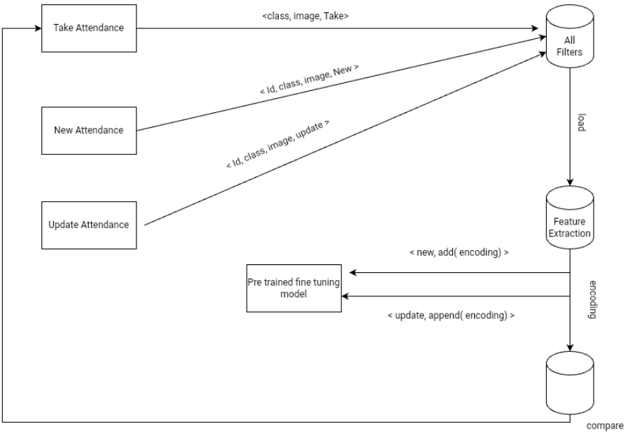

<h1>Attendance Management using Face Recognition</h1>

  <b>Attendance system using face
recognition is a procedure of recognizing students by using
face biostatistics based on the high definition monitoring
and other computer technologies.</b> The development of this
system is aimed to accomplish digitization of the traditional
system of taking attendance by calling names and
maintaining pen-paper records. 

Our approach is using the world’s simplest face recognition library built using dlib’s state-of-the-art face recognition built with deep learning. This face_recognition model has high accuracy ensuring low false-positive detection , efficiency and robust in nature. After face recognition attendance reports will be generated and stored in excel format. 

<h1>Description</h1>

 This system used pretrained fine turing model face_recognition and recognized faces by comparing face encodings 

  
<h1> This is how directory structure looks like</h1>

  <code>├───ams
│   ├───migrations
│   │   └───__pycache__
│   ├───templates
│   │   └───static
│   │       ├───css
│   │       ├───js
│   │       └───media
│   └───__pycache__
├───models
├───pictures
│   ├───N18
│   │   └───cse
│   │       ├───cse1
│   │       └───cse2
│   │           └───Sample
│   ├───N19
│   │   └───cse
│   │       └───cse1
│   └───N20
│       └───cse
│           ├───cse1
│           │   ├───N181022
│           │   ├───N200037
│           │   ├───N200377
│           │   ├───N200381│           │   
│           │   ├───N201064
│           │   └───N201070
│           └───cse2
│               ├───N170976
│               ├───N180789
│               ├───N180825
│               └───N181022
├───project2
│   └───__pycache__
└───static
    ├───admin
    │   ├───css
    │   │   └───vendor
    │   │       └───select2
    │   ├───img
    │   │   └───gis
    │   └───js
    │       ├───admin
    │       └───vendor
    │           ├───jquery
    │           ├───select2
    │           │   └───i18n
    │           └───xregexp
    ├───css
    ├───js
    └───media</code>

<h1>Seeting up application</h1>

  <li>start the mysql server first</li>
  <li>specify the mysql port and credentials of mysql in project2>settings.py files as shown in the below figure
    
</li>
  <li>Now got to the build directory and open command prompt and then enter  
    <code>python manage.py runsslserver --cert cert.pem --key key.pem localhost:3000</code>
    
  </li>
  <li>open the address in the browser and browse for localhost:3000</li>
  
  

<h1>References</h1>
Know More About The AMS 
<ul>
<li><a href="https://drive.google.com/file/d/19H9eQcFepn7br-3Xrph3rZdQvUhv4VoS/view?usp=drivesdk">Documentation (Technical Details)</a></li>
<li><a href="https://drive.google.com/file/d/1edLgPpHAH3xXXX-mTyO3mEtW9MHnhsft/view">Video (Promo)</a></li>
<li><a href="https://github.com/pvscreations/AMS_frontend_react">Frontend React Source Code</a></li>
</ul>

